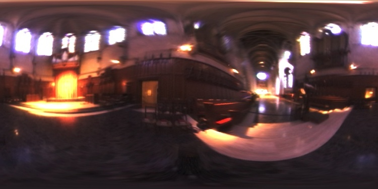
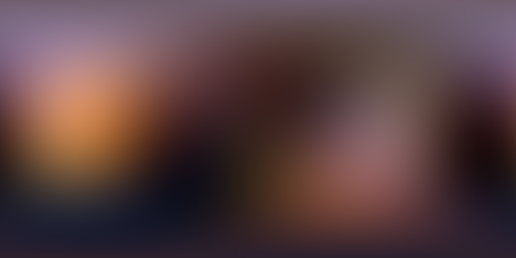
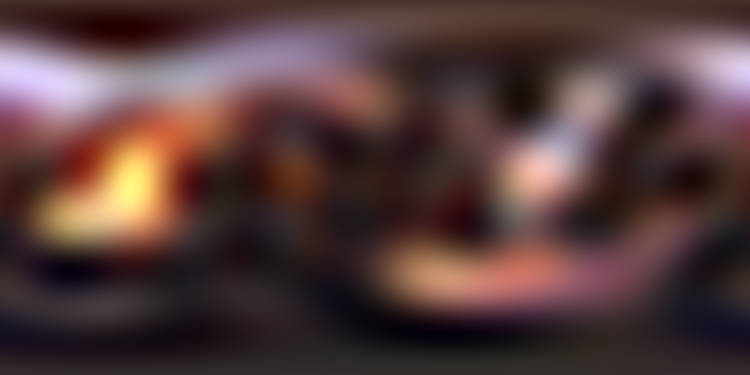
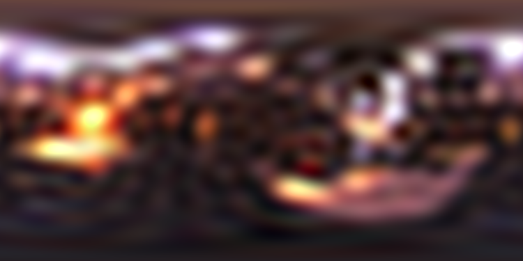

# Spherical Harmonics Representation of Environment Lighting
Compute the Spherical Harmonics(SH) coefficients and representation of given
environment map.
For details of SH, please refer to:
* [Spherical Harmonics](https://en.wikipedia.org/wiki/Spherical_harmonics)
* [Spherical Harmonics Lighting](https://en.wikipedia.org/wiki/Spherical_harmonic_lighting)

### Demo
<figure>
  

  
  <figcaption>original map</figcaption>
  
  <figcaption>degree: 4</figcaption>
  
  <figcaption>degree: 11</figcaption>
  
  <figcaption>degree: 21</figcaption>
  
  <figcaption>degree: 51</figcaption>
  

</figure>
